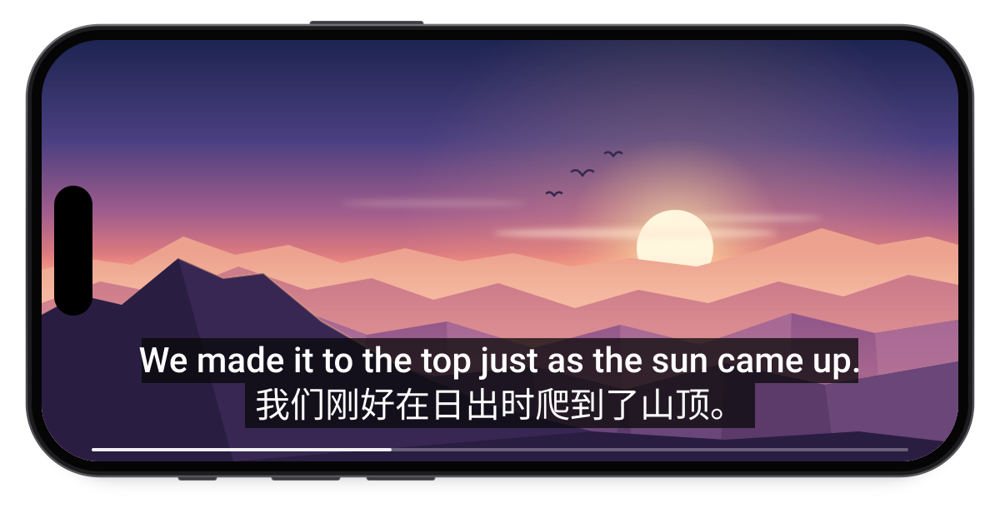
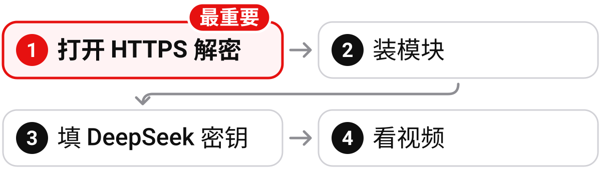
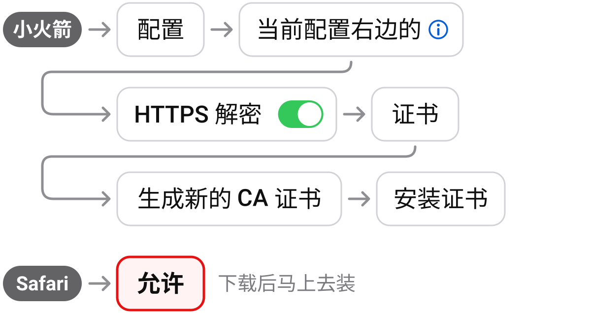
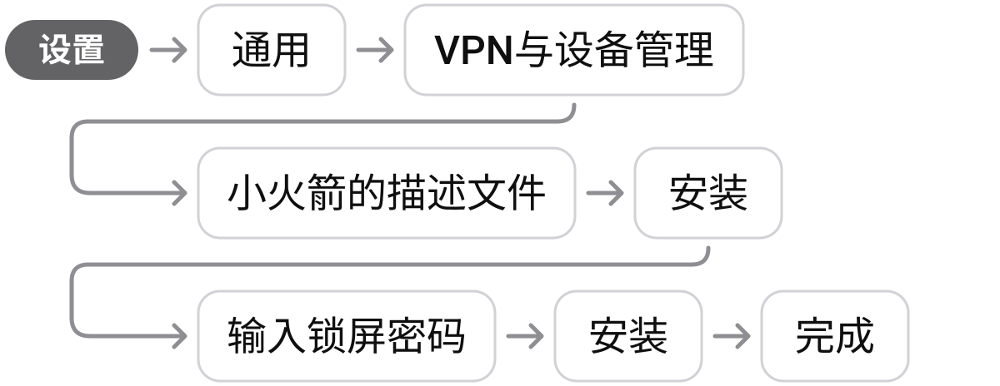
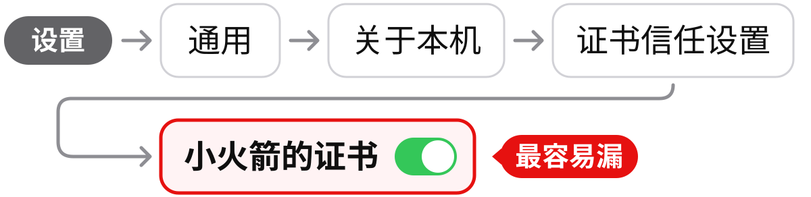
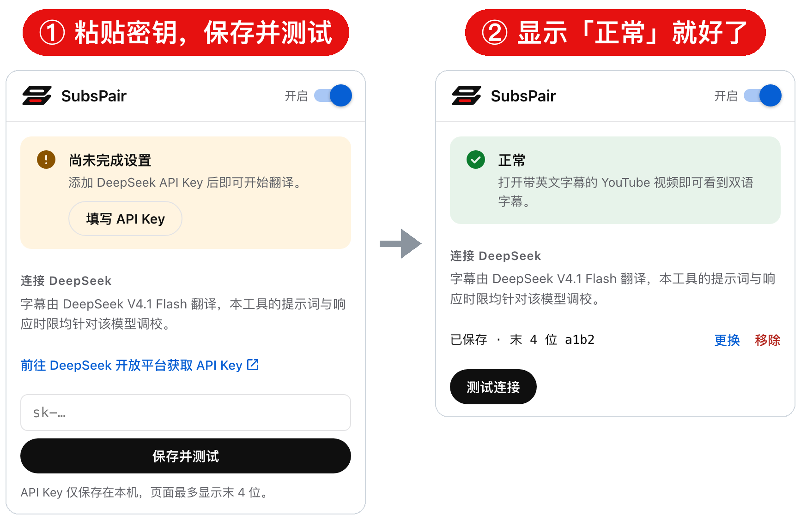

<p align="center">
  <picture>
    <source media="(prefers-color-scheme: dark)" srcset=".github/assets/logo-dark.svg">
    
  </picture>
</p>

<h1 align="center">SubsPair</h1>

<p align="center"><b>AI 驱动的 YouTube 双语字幕生成器，iPhone、iPad 上 App 和网页版通用</b></p>

<p align="center">
  <a href="https://kaixuedev.github.io/SubsPair/"></a>
</p>

<p align="center">
  <a href="#安装">安装</a> · <a href="#隐私">隐私</a> · <a href="#常见问题">常见问题</a>
</p>

<p align="center">
  
</p>

SubsPair 是一个本地字幕模块：借用小火箭（Shadowrocket）在手机上运行脚本的功能，把 YouTube 的英文字幕发给你自己的 DeepSeek 账户译成中文，上英下中，直接显示在官方 YouTube App 里。

## 安装

<p align="center">
  
</p>

你需要：一台装了小火箭的 iPhone 或 iPad，一个充了值的 [DeepSeek 开放平台账户](https://platform.deepseek.com/)。

### 第一步：打开 HTTPS 解密（最重要）

> [!IMPORTANT]
> 装好了却没反应，大多是这一步没做完，尤其是最后的「完全信任」。以前给别的模块做过的，可以跳过。

**① 全局路由选「配置」**

<p align="center"></p>

**② 在小火箭里打开解密、安装证书**

<p align="center"></p>

点完「允许」只是下载好了，马上接着做 ③，放久了会自动消失。

**③ 在「设置」里安装证书**

<p align="center"></p>

<details>
<summary>装不上？</summary>

iOS 17.3 以上开着「失窃设备保护」、人又不在常待的地方时会被拦住：回到家里、公司这类常待的地方再装。

</details>

**④ 打开「完全信任」（最容易漏）**

<p align="center"></p>

这里看不到证书，说明 ③ 没装上，回去再装一次。

<details>
<summary>这张证书安全吗？</summary>

它是小火箭在你手机上现场生成的，只在你手机上用来解密指定网站的请求；SubsPair 只请它解密 YouTube 和设置页。

只信任这一张，别人发来的证书不要装。

以后不用了，在「设置 → 通用 → VPN与设备管理」里删掉即可。

</details>

### 第二步：装模块

点最上面的「一键安装到小火箭」红色按钮，在打开的安装页里再点一次；或者复制下面的地址，在小火箭「配置 → 模块」点右上角「+」粘贴。

```
https://raw.githubusercontent.com/kaixuedev/SubsPair/release/SubsPair.sgmodule
```

小火箭提示「No PKCS12 Certificates」（意思是还没有可用的证书）：说明第一步没做完，做完后把模块删掉重装。

### 第三步：填 DeepSeek 密钥

用 Safari 打开 **<https://subs.test/>**，点「前往 DeepSeek 开放平台获取 API Key」，创建一个密钥并复制（只显示一次），回来粘贴。填好后，你看的视频的字幕全文会发给 DeepSeek 翻译，详见[隐私](#隐私)。

<p align="center"></p>

打不开、提示「此连接非私人连接」：第一步的 ④ 还没做。

### 第四步：看视频

打开 YouTube App 里的英文视频，字幕选英文（不要选「自动翻译」），几秒内就会出现上英下中的双语字幕。

## 隐私

> [!WARNING]
> 翻译不是在手机上离线完成的。填好密钥后，你看的每个视频的字幕全文都会发给你选择的模型服务商（默认是 DeepSeek，可以在设置页「翻译模型」里换），对方能看到并可能留存，字幕全文足以看出你在看什么视频。
>
> 服务商一般会按它的用户协议和适用的法律法规审核收到的内容，可能拒绝翻译、保存记录，或者限制你的账户。不想发出去的视频，看之前先打开设置页，把右上角的开关关掉（显示「已关闭」）。
>
> 除此之外，所有数据只存在你自己的手机上，我们没有服务器。

| 什么 | 去哪里 |
| --- | --- |
| 字幕原文 | 发给你选的模型服务商（默认 DeepSeek） |
| API Key、译文、没翻完的英文字幕、设置 | 保存在你的手机上 |
| 开发者 | 没有服务器，收不到你的使用数据 |

HTTPS 解密意味着什么，见[安全说明](SECURITY.md)。

## 常见问题

<details>
<summary><b>只有英文，没有中文？</b></summary>

按顺序查：

1. 小火箭已开启、「模块」里 SubsPair 打开了
2. 第一步的 ① 到 ④ 都做了
3. 设置页首页显示「正常」（不正常就按页面提示处理，或点「测试连接」）
4. 字幕选的是英文，不是「自动翻译」
5. 把视频关掉重开

</details>

<details>
<summary><b>设置页打不开？</b></summary>

小火箭已开启、模块打开了；第一步的 ④ 做了；地址要输完整的 <https://subs.test/>。

</details>

<details>
<summary><b>换了小火箭的配置，又没反应了？</b></summary>

HTTPS 解密跟着配置走，对新配置重做一遍第一步。

</details>

<details>
<summary><b>提示「字幕加载错误」？</b></summary>

把字幕关掉再打开。加载时别反复点字幕按钮。

</details>

<details>
<summary><b>长视频后半段没有中文？</b></summary>

剩下的在后台接着翻，过几分钟重开视频就好。特别长的视频（几个小时），最后面可能仍是英文。在「高级设置」里关了「长视频后台翻译」的话，就不会在后台接着翻了，每次重开视频只会再往后翻一段。

</details>

<details>
<summary><b>同时装了别的 YouTube 字幕模块？</b></summary>

SubsPair 可能不起作用。关掉那个模块的自动翻译开关，或者停用它。

</details>

<details>
<summary><b>要花多少钱？</b></summary>

SubsPair 完全免费。翻译按你 DeepSeek 账户的用量计费。

长视频没看的部分也会在后台接着翻、同样计费，不想要就在设置页「高级设置」关掉「长视频后台翻译」。余额不足会自动暂停，充值后点「恢复翻译」。

</details>

<details>
<summary><b>能用别的模型吗？</b></summary>

可以，在设置页「翻译模型」里换。推荐 DeepSeek，因为速度和效果都是按它调的。

</details>

<details>
<summary><b>支持哪些设备和 App？</b></summary>

| 在什么上看 | 能用吗 |
| --- | :---: |
| iPhone、iPad 上的官方 YouTube App | ✅ |
| iPhone、iPad 上打开的 YouTube 网页版 | ✅ |
| 装了小火箭的 Mac（网页版） | 未验证，理论上可行 |
| 直播、没有字幕的视频 | ❌ |

</details>

## 声明

- SubsPair 只在你的手机上运行，只处理 YouTube 字幕的读取与显示；翻译由你自己选择并开通的模型服务商完成，本项目不提供模型服务，不提供任何网络接入服务，不含服务器配置；开发者不运营服务器、不收集数据、不收费。
- 译文由模型自动生成，可能有误或不完整，只供你自己观看。
- 本项目与 YouTube、Shadowrocket、DeepSeek 均无关联；请在所在地法律法规允许的范围内使用，并遵守相关服务的条款。
- 本项目免费开源，按 MIT 许可证「按原样」提供，不作任何担保。

[反馈问题](https://github.com/kaixuedev/SubsPair/issues/new/choose) · [MIT 许可证](LICENSE) · [参与贡献](CONTRIBUTING.md) · [报告安全问题](SECURITY.md)
